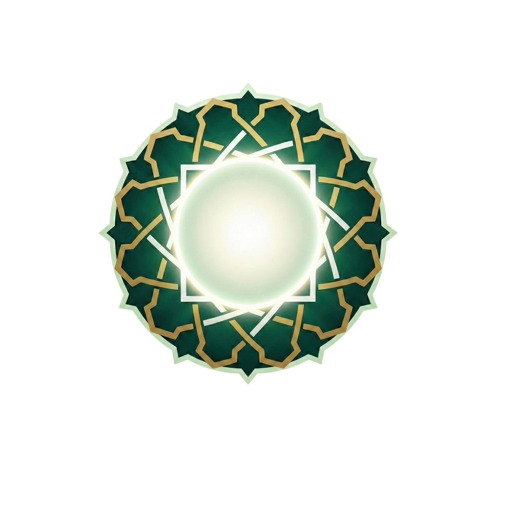

# Sekine TV - Islamic Prayer Times & Quran Display

<p align="center">
  
</p>

<p align="center">
  <strong>A beautiful, feature-rich Islamic prayer times display application designed for TV screens, digital signage, and home displays.</strong>
</p>

<p align="center">
  <a href="#features">Features</a> •
  <a href="#screenshots">Screenshots</a> •
  <a href="#installation">Installation</a> •
  <a href="#configuration">Configuration</a> •
  <a href="#architecture">Architecture</a> •
  <a href="#api-reference">API Reference</a>
</p>

---

## 📖 Overview

Sekine TV is a comprehensive Islamic application built with React and TypeScript, designed to display prayer times, Quran recitations, and Islamic content on large displays. It features multiple layout options, customizable themes, and support for various calculation methods used worldwide.

### Key Highlights

- **🕌 Accurate Prayer Times**: Multiple calculation methods (MWL, ISNA, Egypt, Makkah, Karachi, etc.)
- **📖 Quran Player**: Full Quran with multiple reciters and verse-by-verse display
- **🎨 Multiple Layouts**: 5 unique idle screen layouts + 4 screensaver layouts
- **🌙 Night Mode**: Automatic dimming based on time settings
- **🧭 Qiblah Compass**: Static compass showing direction to Mecca
- **🌍 Multi-language**: 10 languages including Arabic, Urdu, Turkish, and more
- **📺 TV-Optimized**: Keyboard/remote navigation support for smart TVs
- **🎵 Adhan & Invocations**: Built-in audio for prayers and daily supplications

---

## ✨ Features

### Prayer Times
- Automatic calculation based on geographic coordinates
- Support for 7+ calculation methods
- Juristic method selection (Shafi/Hanbali vs Hanafi)
- Hijri date display with customizable calendar adjustments
- Countdown to next prayer
- Iqamah time configuration per prayer

### Quran Player
- Complete Quran with 114 surahs
- Multiple renowned reciters (Mishary Rashid, Abdul Basit, etc.)
- Verse-by-verse synchronized display
- Arabic text with English translation
- Continuous playback with repeat options
- Background images per surah

### Jawshan Kabir
- Complete Jawshan Kabir supplication (100 sections)
- Arabic text with transliteration and translation
- Audio playback support
- Section-by-section navigation
- Progress tracking

### Invocations (Adhkar)
- Prayer-specific invocations (Fajr, Dhuhr, Asr, Maghrib, Isha)
- Morning and evening adhkar
- Audio playback for each invocation

### Display Options
- 5 Idle screen layouts: Classic, Minimal, Split, Prayer Focus, Dashboard
- 4 Screensaver layouts: Classic, Minimal, Ambient, Prayer Focus, Quote Focus
- Customizable backgrounds (6 built-in themes)
- Quote of the day display
- Hijri date toggle

### Qiblah Direction
- Automatic calculation based on user location
- Static compass visualization with premium styling
- Cardinal direction display (N, NE, E, SE, S, SW, W, NW)
- Integrated into all idle layouts

### Localization
- 10 supported languages
- RTL support for Arabic and Urdu
- Localized prayer names and UI elements

---

## 🛠 Tech Stack

| Category | Technology |
|----------|------------|
| **Framework** | React 18.3 |
| **Language** | TypeScript |
| **Build Tool** | Vite |
| **Styling** | Tailwind CSS |
| **UI Components** | shadcn/ui (Radix UI primitives) |
| **Routing** | React Router DOM 6 |
| **State Management** | React Context API |
| **Data Fetching** | TanStack Query (React Query) |
| **Forms** | React Hook Form + Zod |
| **Date Handling** | date-fns |
| **Icons** | Lucide React |
| **Animations** | Tailwind CSS Animations |
| **Testing** | Vitest |

---

## 📁 Project Structure

```
sekine-tv/
├── public/
│   ├── audio/jawshan/          # Jawshan audio files
│   ├── favicon.ico
│   ├── placeholder.svg
│   └── robots.txt
│
├── src/
│   ├── assets/                 # Static assets
│   │   ├── audio/              # Invocation audio files
│   │   ├── bg-*.jpg            # Background images
│   │   ├── mosque-background-*.jpg
│   │   └── sekine-logo.png
│   │
│   ├── components/             # React components
│   │   ├── idle-layouts/       # Idle screen layouts
│   │   ├── layout-previews/    # Layout preview cards
│   │   ├── player/             # Media player components
│   │   ├── screensaver-layouts/# Screensaver layouts
│   │   ├── ui/                 # shadcn/ui components
│   │   └── [Component].tsx     # Shared components
│   │
│   ├── contexts/               # React contexts
│   │   └── AppContext.tsx      # Global app state
│   │
│   ├── data/                   # Static data files
│   │   ├── dailyQuotes.ts      # Quotes for each day
│   │   ├── invocations.ts      # Adhkar data
│   │   ├── jawshan.ts          # Jawshan Kabir content
│   │   ├── juz.ts              # Quran juz divisions
│   │   ├── quotes.ts           # General quotes
│   │   ├── reciters.ts         # Quran reciters
│   │   └── surahs.ts           # Surah metadata
│   │
│   ├── hooks/                  # Custom React hooks
│   │   ├── use-mobile.tsx      # Mobile detection
│   │   ├── use-toast.ts        # Toast notifications
│   │   ├── usePrayerTimes.ts   # Prayer time calculations
│   │   ├── useQiblah.ts        # Qiblah direction
│   │   ├── useQuranAPI.ts      # Quran data fetching
│   │   └── useTVNavigation.ts  # TV remote navigation
│   │
│   ├── layouts/                # Layout wrappers
│   │   └── DashboardLayout.tsx
│   │
│   ├── lib/                    # Utility libraries
│   │   ├── i18n.ts             # Internationalization
│   │   ├── prayerUtils.ts      # Prayer calculations
│   │   ├── qiblahUtils.ts      # Qiblah calculations
│   │   ├── quranAPI.ts         # Quran API client
│   │   ├── surahBackgrounds.ts # Surah background mapping
│   │   └── utils.ts            # General utilities
│   │
│   ├── pages/                  # Route pages
│   │   ├── dashboard/          # Dashboard pages
│   │   ├── settings/           # Settings sub-pages
│   │   ├── setup/              # First-run setup wizard
│   │   └── [Page].tsx          # Main pages
│   │
│   ├── test/                   # Test files
│   │   ├── example.test.ts
│   │   └── setup.ts
│   │
│   ├── types/                  # TypeScript types
│   │   ├── app.ts              # App-wide types
│   │   ├── prayer.ts           # Prayer types
│   │   └── quran.ts            # Quran types
│   │
│   ├── App.tsx                 # Root component
│   ├── App.css                 # Global styles
│   ├── index.css               # Tailwind imports
│   └── main.tsx                # Entry point
│
├── docs/                       # Documentation
│   ├── COMPONENTS.md           # Component documentation
│   ├── HOOKS.md                # Hook documentation
│   ├── DATA.md                 # Data structure documentation
│   └── API.md                  # API documentation
│
├── index.html                  # HTML template
├── tailwind.config.ts          # Tailwind configuration
├── vite.config.ts              # Vite configuration
├── vitest.config.ts            # Vitest configuration
└── package.json                # Dependencies
```

---

## 🚀 Installation

### Prerequisites

- Node.js 18+ or Bun
- npm, yarn, or bun package manager

### Setup

```bash
# Clone the repository
git clone https://github.com/your-username/sekine-tv.git
cd sekine-tv

# Install dependencies
npm install
# or
bun install

# Start development server
npm run dev
# or
bun dev

# Build for production
npm run build
# or
bun run build
```

### Environment Variables

No environment variables are required for basic functionality. The app uses client-side APIs for prayer time calculations and Quran data.

---

## ⚙️ Configuration

### First-Run Setup Wizard

On first launch, users are guided through a setup wizard:

1. **Welcome Screen** - Introduction to the app
2. **Language Selection** - Choose from 10 languages
3. **Location Setup** - Set city, country, and coordinates
4. **Calculation Method** - Select prayer time calculation method
5. **Mode Selection** - Choose Masjid or Home mode
6. **Pairing (Optional)** - Pair with mobile dashboard
7. **Setup Complete** - Ready to use

### Settings Categories

| Setting | Description |
|---------|-------------|
| **Location** | City, country, latitude, longitude, timezone |
| **Calculation** | Method (MWL, ISNA, etc.), juristic school, adjustments |
| **Display** | Layout, background, clock format, Hijri date toggle |
| **Adhan** | Enable/disable per prayer, sound selection |
| **Iqamah** | Delay time per prayer (minutes after adhan) |
| **Night Mode** | Auto-dim settings with start/end times |
| **Quran** | Default reciter, translation preferences |

---

## 🏗 Architecture

### State Management

The app uses React Context for global state management:

```typescript
// AppContext provides:
interface AppContextType {
  settings: AppSettings;           // All app settings
  appState: AppState;              // Current app state
  playerState: PlayerState;        // Media player state
  updateSettings: (settings) => void;
  setAppState: (state) => void;
  setPlayerState: (state) => void;
  completeSetup: () => void;
  resetApp: () => void;
}
```

### Data Flow

```
┌─────────────────┐     ┌──────────────────┐     ┌─────────────────┐
│   User Input    │────▶│   AppContext     │────▶│   Components    │
└─────────────────┘     └──────────────────┘     └─────────────────┘
                               │
                               ▼
                        ┌──────────────────┐
                        │  localStorage    │
                        │   (persistence)  │
                        └──────────────────┘
```

### Prayer Time Calculation

Prayer times are calculated client-side using astronomical formulas:

1. User provides latitude, longitude, and timezone
2. `usePrayerTimes` hook calculates times based on selected method
3. Times are recalculated on date change or settings update
4. Next prayer countdown updates every second

### Qiblah Direction Calculation

Uses the spherical bearing formula:

```typescript
// Kaaba coordinates: 21.4225°N, 39.8262°E
const bearing = Math.atan2(
  Math.cos(φ2) * Math.sin(Δλ),
  Math.cos(φ1) * Math.sin(φ2) - Math.sin(φ1) * Math.cos(φ2) * Math.cos(Δλ)
);
```

---

## 📚 API Reference

### External APIs

#### Quran API (Al-Quran Cloud)

```typescript
// Base URL
const API_BASE = 'https://api.alquran.cloud/v1';

// Endpoints used:
GET /surah/{surahNumber}                    // Get surah metadata
GET /surah/{surahNumber}/{edition}          // Get surah with specific edition
GET /surah/{surahNumber}/ar.alafasy         // Get Arabic audio edition
```

### Internal APIs

See [docs/API.md](docs/API.md) for detailed internal API documentation.

---

## 🎨 Theming

### Color Palette

The app uses a carefully crafted color system defined in `index.css`:

```css
:root {
  /* Primary - Gold tones */
  --primary: 43 74% 49%;
  --primary-foreground: 0 0% 100%;
  
  /* Background - Dark tones */
  --background: 222 47% 6%;
  --foreground: 43 30% 90%;
  
  /* Card - Glass effect */
  --card: 222 30% 12%;
  --card-foreground: 43 30% 90%;
  
  /* Accents */
  --accent: 43 60% 20%;
  --muted: 222 30% 18%;
}
```

### Background Themes

| Theme | Description |
|-------|-------------|
| `celestial` | Deep blue starry sky |
| `desert` | Warm desert sunset |
| `light` | Bright daylight scene |
| `mountains` | Majestic mountain landscape |
| `ocean` | Calm ocean waves |
| `paradise` | Lush green paradise |

### Glass-Card Effect

```css
.glass-card {
  @apply bg-card/40 backdrop-blur-sm border border-border/30 rounded-2xl;
}
```

---

## 📱 Pages & Routes

| Route | Component | Description |
|-------|-----------|-------------|
| `/` | `Index` | Redirects to `/idle` or `/setup` |
| `/idle` | `Idle` | Main display screen |
| `/screensaver` | `Screensaver` | Auto-activated screensaver |
| `/quran` | `Quran` | Quran surah selection |
| `/player` | `Player` | Media player (Quran, Adhan, etc.) |
| `/jawshan` | `Jawshan` | Jawshan Kabir reader |
| `/settings` | `Settings` | Settings menu |
| `/settings/*` | Various | Settings sub-pages |
| `/setup/*` | Various | First-run setup wizard |
| `/adhan` | `Adhan` | Adhan display screen |
| `/iqamah` | `Iqamah` | Iqamah countdown |
| `/splash` | `Splash` | Loading splash screen |
| `/pairing` | `Pairing` | Device pairing screen |

---

## 🧩 Component Reference

See [docs/COMPONENTS.md](docs/COMPONENTS.md) for detailed component documentation.

### Key Components

| Component | Purpose |
|-----------|---------|
| `BackgroundSlideshow` | Animated background with parallax |
| `PrayerTimesGrid` | Prayer times display grid |
| `PrayerCard` | Individual prayer time card |
| `QiblahCompass` | Static compass SVG component |
| `QiblahBadge` | Compact Qiblah direction badge |
| `GlobalAudioPlayer` | Audio playback management |
| `MiniPlayer` | Minimized player bar |
| `NavigationBar` | TV-friendly navigation |

---

## 🪝 Hook Reference

See [docs/HOOKS.md](docs/HOOKS.md) for detailed hook documentation.

### Custom Hooks

| Hook | Purpose |
|------|---------|
| `useApp` | Access global app context |
| `usePrayerTimes` | Calculate prayer times |
| `useQiblah` | Calculate Qiblah direction |
| `useQuranAPI` | Fetch Quran data |
| `useTVNavigation` | Handle TV remote input |
| `useTranslation` | Access i18n translations |
| `useMobile` | Detect mobile viewport |
| `useToast` | Show toast notifications |

---

## 📊 Data Structures

See [docs/DATA.md](docs/DATA.md) for detailed data documentation.

### Key Data Files

| File | Content |
|------|---------|
| `surahs.ts` | 114 surahs with metadata |
| `reciters.ts` | Quran reciters with API identifiers |
| `jawshan.ts` | 100 Jawshan sections with translations |
| `invocations.ts` | Daily adhkar with audio |
| `dailyQuotes.ts` | 366 daily quotes |
| `juz.ts` | 30 juz divisions |

---

## 🌐 Internationalization

### Supported Languages

| Code | Language | Native Name | RTL |
|------|----------|-------------|-----|
| `en` | English | English | No |
| `ar` | Arabic | العربية | Yes |
| `ur` | Urdu | اردو | Yes |
| `fr` | French | Français | No |
| `es` | Spanish | Español | No |
| `tr` | Turkish | Türkçe | No |
| `id` | Indonesian | Bahasa Indonesia | No |
| `bn` | Bengali | বাংলা | No |
| `de` | German | Deutsch | No |
| `ru` | Russian | Русский | No |

### Usage

```typescript
import { useTranslation } from '@/lib/i18n';

const MyComponent = () => {
  const { t } = useTranslation();
  return <h1>{t('prayer.fajr')}</h1>; // "Fajr" or "الفجر"
};
```

---

## 📺 TV Navigation

The app is optimized for TV remotes and keyboards:

| Key | Action |
|-----|--------|
| `←` `→` `↑` `↓` | Navigate between elements |
| `Enter` / `Space` | Select/Activate |
| `Escape` / `Backspace` | Go back |
| `P` | Play/Pause |
| `M` | Mute/Unmute |

### Focus Management

Elements with `data-focusable="true"` are included in keyboard navigation:

```tsx
<button data-focusable="true" onClick={handleClick}>
  Click Me
</button>
```

---

## 🧪 Testing

```bash
# Run tests
npm run test
# or
bun test

# Run tests with coverage
npm run test:coverage
```

---

## 📄 License

This project is licensed under the MIT License - see the [LICENSE](LICENSE) file for details.

---

## 🤝 Contributing

Contributions are welcome! Please read our [Contributing Guidelines](CONTRIBUTING.md) before submitting a pull request.

---

## 🙏 Acknowledgments

- [Al-Quran Cloud API](https://alquran.cloud/) for Quran data
- [Aladhan API](https://aladhan.com/) for prayer time calculations reference
- [shadcn/ui](https://ui.shadcn.com/) for beautiful UI components
- [Lucide](https://lucide.dev/) for icons
- All the Quran reciters whose beautiful recitations are included

---

<p align="center">Made with ❤️ for the Muslim Ummah</p>
